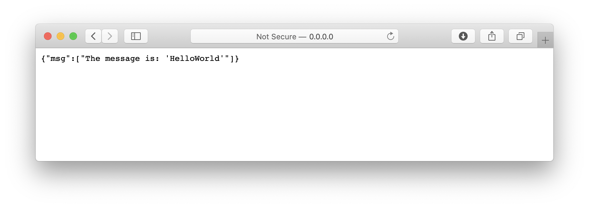

plumber.pack
============

A minimal example of a Plumber API wrapped in a R package and meant to be deployed via Docker. This has several features:

- [**plumber**](https://www.rplumber.io) provides a web API that can be used to interface with R-based functionality
- the R package structure makes it easier to do unit testing via **testthat**, document functions, and the other usual R package stuff
- [**Docker**](https://www.google.com/url?sa=t&rct=j&q=&esrc=s&source=web&cd=1&cad=rja&uact=8&ved=2ahUKEwjj3MfEiYPnAhVk2aYKHaQoAeMQFjAAegQIDxAC&url=https%3A%2F%2Fwww.docker.com%2F&usg=AOvVaw3p9e1qPvdfjCrUwPYAhUlS) makes it easier to install and run the whole thing somewhere other than your laptop

The end result is something that allows you to run R-based functionality on a server somewhere and which people can interact with using a web API.

## Installation

To install and run this from R locally, on your laptop:

```r
library("remotes")
remotes::install_github("andybega/plumber.pack")
```

This installs the package and plumber file. To run the API, from R:

```r
library("plumber.pack")
start_api()
```

(If you do this from RStudio, a new window should pop up.)

But really this is meant to work with Docker. First, make sure Docker is installed and running. Then it should be possible to run this in Bash or Terminal to build the Docker image and run a container that will start the API:

```zsh
docker build -t plumberpack . 
docker run --rm -p 5018:5018 plumberpack
```

## Using

Once installed and running, go in a browser to, for example, http<nolink>://0.0.0.0:5018/ and you should see some text displaying the package version number. 


The behavior can be controlled by modifying the ULR based on whatever endpoints are defined in the plumber file. This is the output for http<nolink>://0.0.0.0:5018/echo?msg=HelloWorld:



Instead of a broswer, with `curl`:

```zsh
curl http://0.0.0.0:5018
```

```
[["Hello World!; plumber.pack version 0.1.0"]]
```

And so on:

```zsh
curl http://0.0.0.0:5018/echo?msg=HelloWorld
```

```
{"msg":["The message is: 'HelloWorld'"]} 
```
